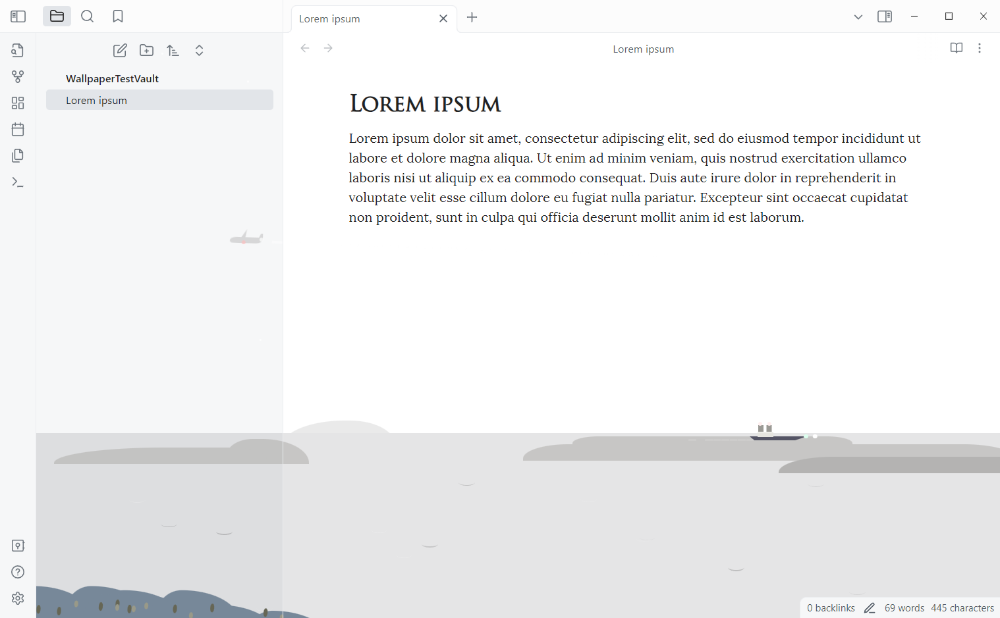
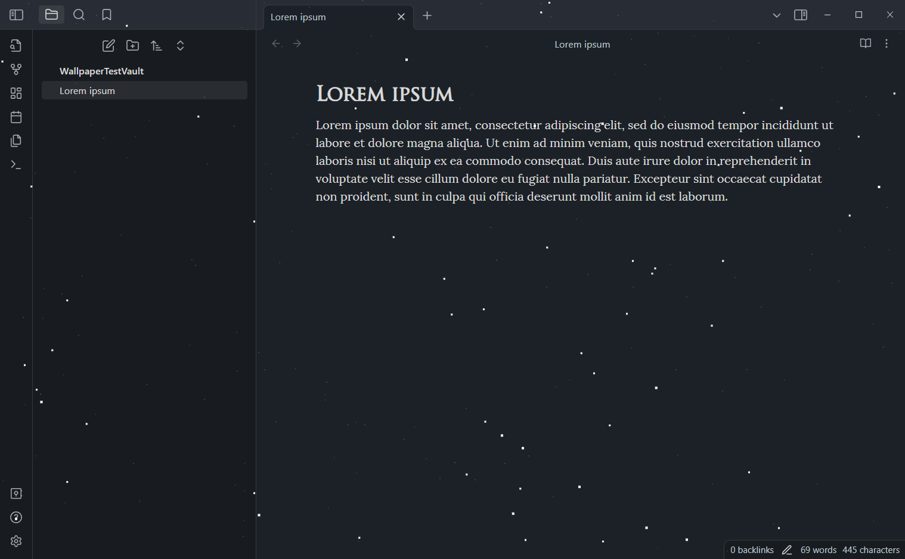
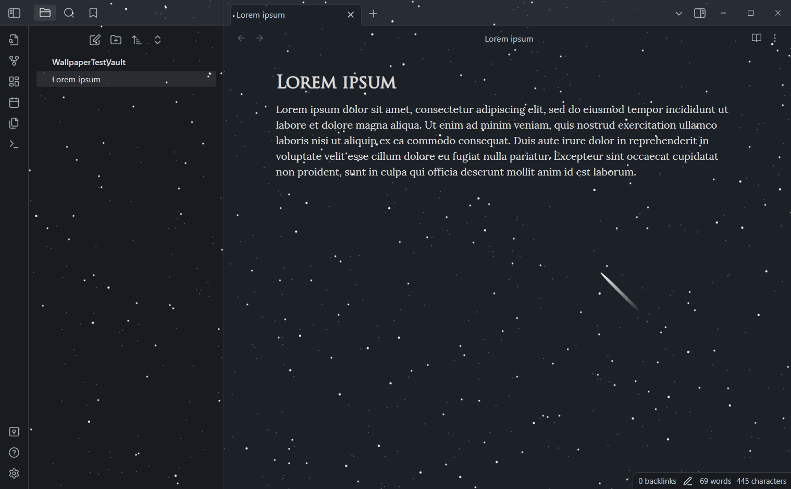
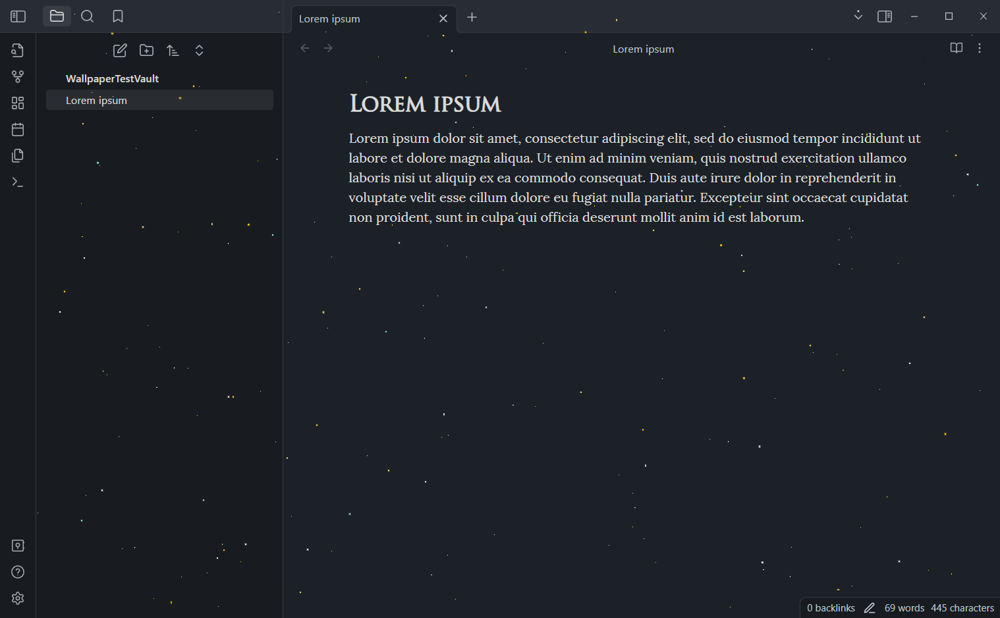
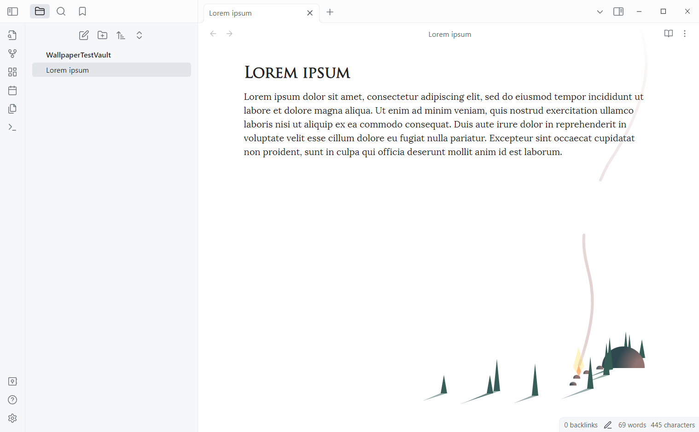
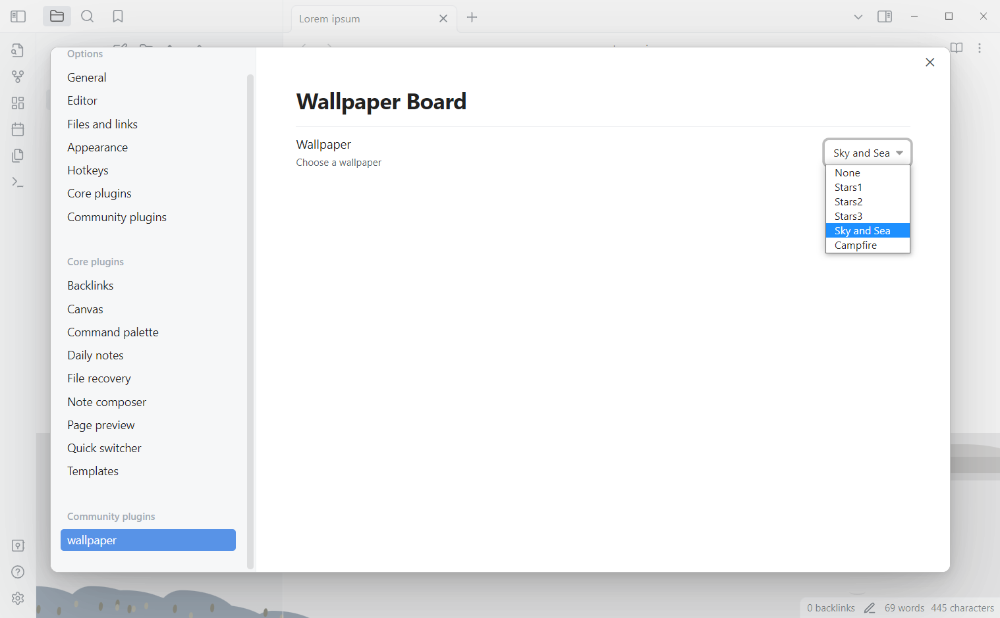

# Obsidian Wallpaper

I like to see all kinds of beautiful front-end works made by great coder on [codepen.io](https://codepen.io/), and I really want to see these effects in my vault, so I tried to write this plugin. 

This plugin can add some pretty live wallpapers to your vault. By modifying the source code downloaded from [codepen.io](https://codepen.io/), I have successfully implemented five projects in the library so far.

- Sky and Sea: [CodePen Home
CSS Illustration 'Sky and Sea'](https://codepen.io/WhitePallet/details/YYmZEK)
- Stars1: [Parallax Star background in CSS](https://codepen.io/sarazond/pen/LYGbwj)
- Stars2: [CodePen Home
Stars #Codevember_08](https://codepen.io/johnbgarcia/pen/qqdgGp)
- Stars3: [A sky full of stars](https://codepen.io/jlnljn/pen/gRrOxM)
- Campfire: [Campfire Colony](https://codepen.io/jackiezen/pen/gOOgvOO?editors=1000)

ps. please ignore the names I gave them, as they are to be put in the Settings, I don't think of too long names.

## Screenshot and Video

The screenshots and videos shown below are from the theme: Things, hence the dark blue background. The effect may vary depending on the subject

### Sky And Sea

<video width="320" height="240" controls>
  <source src="assets/skyandsea.mp4" type="video/mp4">
  Your browser dosen't support playing this video.
</video>

### Stars1

<video width="320" height="240" controls>
  <source src="assets/stars1.mp4" type="video/mp4">
  Your browser dosen't support playing this video.
</video>

### Stars2

<video width="320" height="240" controls>
  <source src="assets/stars2.mp4" type="video/mp4">
  Your browser dosen't support playing this video.
</video>

### Stars3

<video width="320" height="240" controls>
  <source src="assets/stars3.mp4" type="video/mp4">
  Your browser dosen't support playing this video.
</video>

### Campfire

<video width="320" height="240" controls>
  <source src="assets/campfire.mp4" type="video/mp4">
  Your browser dosen't support playing this video.
</video>

## Setting

There is currently only one setting for switching wallpapers.

## Others

If this plugin makes you like your library more, please give it a star. If you have any other projects you want to join, raise an issue. 

Or if you have strong DIY skills.
- Fork this repository.
- npm i, npm run dev
- Add the project's css to 'src/style/*'.
- Add a function to paint the wallpaper in 'src/wallpaper/*'. Add a switch case in 'src/wallpaper/wallpaperPainter.ts'
- Add an option to toggle to new wallpaper in 'settings.js'.